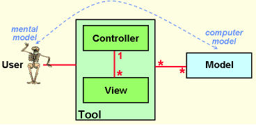
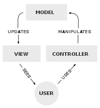
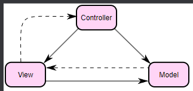
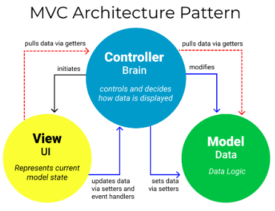
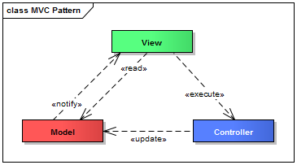
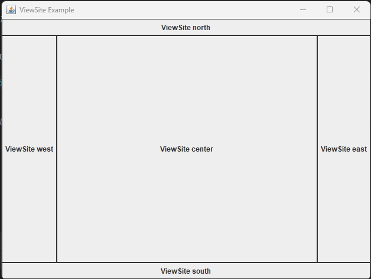

# A pluggable Java Swing MVC architecture

This repository contains a Java Swing example application that is based on 
a pluggable MVC architecture. It is an attempt to show how pluggable user interfaces
can be implemented, and the basic concepts are not constraint to Java Swing at all.

## The Architecture

### MVC

Even though the model-view-controller pattern is widely used and well documented, the way how the different MVC components,
like view, model and controller, are instantiated and wired with the infrastructure is not often discussed.

This repository shows one way of how the MVC instantiation and infrastructure wiring can be done and should
be seen as a starting point for discussions about that topic. 

You can also see this repository as a playground to refactor and try out different ways of implementing an MVC pattern.

#### Yet another MVC

Not only the way how models, views and controllers are instantiated and wired with the infrastructure differs, there are
also a lot of different interpretations of the MVC structure itself.

A lot of different views of the MVC has been described over the time and I would like to show you a few, so that
you can see what I mean with "Yet another MVC".

##### MVC by Trygve Reenskaug

The MVC pattern was invented in 1979 by [Trygve Reenskaug](https://en.wikipedia.org/wiki/Trygve_Reenskaug).

In his work he described the pattern with the following diagram:

##### MVC - wikipedia - english

In the english wikipedia article the MVC pattern is described using slightly different diagram.

As you can see the term `Tool` that Trygve used does not exist anymore. 
Also, the associations between the components have directions now. But the biggest difference is that
controllers and view do not have any association between them.

##### MVC - wikipedia - german

In the german wikipedia article the MVC pattern looks also a little different.

Here you can see the association between the controller and the view. And you can also see that there are
dependencies in both directions, even though the dependency from the view to the controller is a dashed arrow 
(a less strong dependency). The same applies between the view and model.

##### MVC - Freecodecamp.org

Finally, I took a look at yet another description in a [blog post](https://www.freecodecamp.org/news/the-model-view-controller-pattern-mvc-architecture-and-frameworks-explained/) on freecodecamp.org that was written by Rafael D. Hernandez on April 19, 2021.

In this diagram you don't see any dependencies between the view and model at all. The view and model only depend
on the controller.

#### The right MVC!?

I guess it is a normal process that a pattern evolves over time. 
It might have to do with technology changes, but it might also be in consequence of 
translation errors between different languages that lead to a different understanding.

Since there are so many different ways one thinks about the MVC pattern. 
I would like to add my point of view here. The diagram I will show you is taken from my blog post [The MVC pattern implemented with Java Swing](https://link-intersystems.com/blog/2013/07/20/the-mvc-pattern-implemented-with-java-swing/) that I wrote in 2013.
I will explain soon why MVC looks like the following diagram to me and why I think it makes sense compared to the others above.

##### Discussion about my MVC style

When I created my mental model about the MVC, while reading all the other explanations about MVC, I tried to focus on software development principles. 
One principle is the dependency inversion principle. It tells us that

> Abstractions should not depend on details. Details should depend on abstractions.

As a result I asked myself 

> Which of the components is the most abstract and which is the most detailed?

###### Model

The model is the most abstract, since it only captures a mental model that a user has in his mind. 

As a result the model should not depend on any other components. But wait, there is a dependency between
the model and the view. Yes, it's true. But this dependency is an observer relationship where the model is the subject that
emits events when it's state changes to an observer. The model does not know who the observer is. 
It only informs someone that it changed. Thus, the dependency is effectively not a direct dependency to the view.
Itself is inversed by applying the dependency inversion principle.

###### View

In contrast to the model the view is the most detailed component since it defines how a model is presented on the screen.
So the view should depend on all other MVC components, but not vice versa. You can also have different views for the same model.
As a result of a user interaction the view must execute a controller, so it has a dependency to the controller.
It also has a dependency to the model, because it is the visual representation of the model.

###### Controller

The controller is something in between the view and the model. It implements how models are modifies. Therefore, it has
dependencies to models. The controller uses some models as it's input and some models as it's output. E.g. when you perform
a login, the controller reads the models that are connected to the username and password fields and updates a user model.

#### MVC Instantiation

But no matter how you see the MVC and which diagram makes more sense to you, there is still one question open in all these diagrams.

> Who instantiates the MVC components and wires them together as well as 
> connects the controllers to the infrastructure or external systems like databases?

The first though that comes in mind is that there must be some kind of factory. This factory would be the most detail, since it knows all 
the components and how to instantiate them, and it knows the infrastructure.

So the first approach would be to just create something, let's name it MVCPart, that takes a ServiceLocator or something and does the instantiation and wiring job.
But views open other views and if they do that they must use another MVCPart and this part also needs the service locator in order
to connect the controllers to the infrastructure. Hmm, should we pass the service locator through the
MVCParts and the view that it creates? And if we do that it means that the view that opens another view must have a reference to the service locator or
at least an MVCPart that has a dependency to a service locator. So whoever instantiates the MVCPart must have a dependency to the service locator.
If it is a view that was created by another MVCPart then this view must have a dependency to the service locator.

Even when you think that a service locator is not an appropriate way of wiring components with the infrastructure, other ways
will lead to the same problems. E.g. if you use a dependency injection framework, the view that opens another view must be injected by the
dependency injection framework. So when a view opens another it must either call the DI framework or it must use a kind of factory that the DI framework injects.
If the `MVCPart`s are instantiated outside the dependency injection framework they still must be wired in some way with the infrastructure 
and the views that instantiate them must somehow get references to the infrastructure components.

But what if the dependency injection framework just injects the `MVCPart` into a view? Well, this would apply recursively to all MVCParts, because
an MVCPart instantiates views that can instantiate other views and therefore MVCParts. So all MVCParts must be instantiated when the 'main' or root part is created. 
You will also have problems when you want to instantiate a MVCPart (model-view-controller) multiple times, because you need more than one instance and
these instances can not be qualified since they might be created as a result of a user action. So you can not use e.g. @Qualifier annotations in spring.

#### MVC Application State

Another tricky issue is the application state management.

> Who is responsible for holding the application state and how can MVC components access it to share state between views?

I think there must be some kind of context that can hold the application state. This context should support an event mechanism so that components can register listeners in
order to get informed when an object will get available, is changed and so on. This context must somehow be global without being a kind of static reference.

Also, the context might change in the view hierarchy. E.g. there might be some clusters of view components that share a context, but other components that share another instance
of a context.

### MVC Architecture in this Repository

Finally, I came up with the architecture in this repository. Like I said at the beginning "It is one way of solving the instantiation, wiring and application state issues".
So don't be too cruel with me if you don't like my way. You should see it as a starting point for discussions and this repository as a playground for refactoring.

I extended the View from the original MVC and connected it with a `ViewSite`. So my view is a combination of a "normal" view that just defines UI components and the MVCPart that I described above.
One might argue that it would be better to have a dedicated MVCPart and a separate view, but I wanted to keep the component count small, so I merged both aspects into one class.

A `ViewSite` is a place or location where a `View` is installed. It also provides access to the infrastructure and the application state through a `Context`. The `Context` is nothing more than a place where objects can be stored and retrieved from. 
It can be used to share application state as well as providing infrastructure services.

Each `View` can declare its own `ViewSite`s where other `View`s can be installed to. So the center of a border layout might be a `ViewSite`.  
The parent `View` can either delegate it's `Context` to the child view or create a dedicated `Context`.

In my architecture the `View` also contains the logic of how the MVC model, view (ui components) and controller is instantiated and are wired together. It also
knows how to `uninstall` or destruct that composition. If a view is moved from one `ViewSite` to another, e.g. using drag and drop, the view must be uninstalled 
and installed at the new view site.

A `ViewLayout` is a description of `ViewSite`s that are available in a particular `View`.

Here is a simple example of how my architecture works:

1. Create a view that should be visible in the main window

        public class ViewSiteView implements View {
        
            private final String name;
        
            private JPanel panel;
            private ViewSite viewSite;
        
            public ViewSiteView(String name) {
                this.name = requireNonNull(name);
            }
        
            @Override
            public void install(ViewSite viewSite) {
                this.viewSite = viewSite;
        
                panel = new JPanel();
                panel.setLayout(new GridBagLayout());
        
                JLabel jLabel = new JLabel(name);
                GridBagConstraints gbc = new GridBagConstraints();
                gbc.fill = GridBagConstraints.BOTH;
                gbc.insets = new Insets(5, 5, 5, 5);
                panel.add(jLabel, gbc);
        
                panel.setBorder(BorderFactory.createLineBorder(new Color(50, 50, 50)));
        
                ViewContent viewContent = viewSite.getViewContent();
                viewContent.setComponent(panel);
            }
        
            @Override
            public void uninstall() {
                if (viewSite == null) {
                    return;
                }
        
                ViewContent viewContent = viewSite.getViewContent();
                viewContent.setComponent(null);
        
                viewSite = null;
            }
        }

   2.  Create the main window view

           public class ViewSiteExampleView implements View {
        
               // Define the view site names
               public static final String TOP = "top";
               public static final String BOTTOM = "bottom";
               public static final String LEFT = "left";
               public static final String RIGHT = "right";
               public static final String MIDDLE = "middle";
    
               private ViewSite viewSite;
               private JFrame frame;
               private DefaultViewLayout viewLayout;
    
               @Override
               public void install(ViewSite viewSite) {
                   this.viewSite = viewSite;
    
                   // Create the main view component                
                   frame = new JFrame("ViewSite Example");
                   frame.setSize(640, 480);
                   frame.setDefaultCloseOperation(WindowConstants.DO_NOTHING_ON_CLOSE);
                   frame.addWindowListener(new WindowAdapter() {
                       @Override
                       public void windowClosing(WindowEvent e) {
                           uninstall();
                       }
                   });
        
                   frame.setLocationRelativeTo(null);
        
                   // Create the ViewLayout
                   Container contentPane = frame.getContentPane();
                   Context viewContext = viewSite.getViewContext();
                   viewLayout = createViewLayout(viewContext, contentPane);
                   viewContext.put(ViewLayout.class, viewLayout);
        
                   // Instal views into the ViewLayout's view sites
                   installView(viewLayout, TOP, "ViewSite north");
                   installView(viewLayout, BOTTOM, "ViewSite south");
                   installView(viewLayout, LEFT, "ViewSite west");
                   installView(viewLayout, RIGHT, "ViewSite east");
                   installView(viewLayout, MIDDLE, "ViewSite center");
        
                   // Make the main frame visible by setting the ViewContent
                   ViewContent viewContent = viewSite.getViewContent();
                   viewContent.setComponent(frame);
               }
    
               private DefaultViewLayout createViewLayout(Context viewContext, Container viewContainer) {
                   DefaultViewLayout viewLayout = new DefaultViewLayout(viewContext, viewContainer);
    
                   viewLayout.addViewSite(TOP, NORTH);
                   viewLayout.addViewSite(BOTTOM, SOUTH);
                   viewLayout.addViewSite(LEFT, WEST);
                   viewLayout.addViewSite(RIGHT, EAST);
                   viewLayout.addViewSite(MIDDLE, CENTER);
    
                   return viewLayout;
               }
    
               private void installView(ViewLayout viewLayout, String viewSiteName, String areaName) {
                   ViewSiteView viewSiteView = new ViewSiteView(areaName);
                   viewLayout.install(viewSiteName, viewSiteView);
               } 
        
               // Uninstall in reverse order
               @Override
               public void uninstall() {
                   if (viewSite == null) {
                       return;
                   }
        
                   viewLayout.dispose();
        
                   Context viewContext = viewSite.getViewContext();
                   viewContext.remove(ViewLayout.class);
                   viewLayout = null;
        
                   ViewContent viewContent = viewSite.getViewContent();
                   viewContent.setComponent(null);
        
                   frame.dispose();
                   frame = null;
        
                   viewSite = null;
               }
           }

3. Create a main class

       public class ViewSiteExample {
    
           public static void main(String[] args) {
               ViewSiteExampleView viewSiteExampleView = new ViewSiteExampleView();
    
               RootViewSite rootViewSite = new RootViewSite(new DefaultContext());
               viewSiteExampleView.install(rootViewSite);
           }
    
       }

### Make the architecture pluggable

In order to create a pluggable MVC architecture I'm using Java's `ServiceLoader` and interfaces that a
view uses in order to install other views in it's `ViewLayout`. These other views are located using the
`ServiceLoader`. E.g.

1. Define a `ViewLayoutContribution` interface so that other views can provide a contribution to the view layout.

        public interface ViewLayoutContribution {
        
            void install(ViewLayout viewLayout);
        
            void uninstall(ViewLayout viewLayout);
        }

2. The main view loads and installs all views

        private ApplicationViewLayoutMediator initLayoutContributions(ViewLayout viewLayout) {
            ServiceLoaderAction<ViewLayoutContribution> viewContributionAction = new ServiceLoaderAction<>(ViewLayoutContribution.class);
    
            ApplicationViewLayoutMediator viewLayoutMediator = new ApplicationViewLayoutMediator(viewLayout);
            viewContributionAction.setTaskActionListener(viewLayoutMediator);
    
            ActionTrigger.performAction(this, viewContributionAction);
    
            return viewLayoutMediator;
        }
 
3. The action's `TaskListener` installs the view

        public class ApplicationViewLayoutMediator implements TaskActionListener<List<ViewLayoutContribution>, Void> {
    
            private final ViewLayout viewLayout;
    
            private final List<ViewLayoutContribution> viewLayoutContributions = new ArrayList<>();
    
            public ApplicationViewLayoutMediator(ViewLayout viewLayout) {
                this.viewLayout = requireNonNull(viewLayout);
            }
    
            @Override
            public void done(List<ViewLayoutContribution> result) {
                result.forEach(this::installView);
            }
    
            private void installView(ViewLayoutContribution viewLayoutContribution) {
                viewLayoutContribution.install(viewLayout);
                viewLayoutContributions.add(viewLayoutContribution);
            }
    
            public void dispose() {
                viewLayoutContributions.forEach(vc -> vc.uninstall(viewLayout));
            }
        }